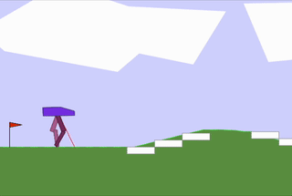

# Gym Environments and Implementing Reinforcement Learning Agents with Stable Baselines
Assignment for Introduction to Intelligent Autonomous Systems, 3º Year,
1º Semester, Bachelor in Artificial Intelligence and Data Science.


# Summary

The aim of the project is
to implement a reinforcement learning agent
using the [stable baselines library](https://github.com/DLR-RM/stable-baselines3) algorithms
and test it with the open-source Python library [Gymnasium](https://github.com/Farama-Foundation/Gymnasium) on this [gym environment](https://gymnasium.farama.org/environments/box2d/car_racing/).


**Autores**:
- [Sebastião Santos Lessa](https://github.com/seblessa/)
- [Margarida Vila Chã](https://github.com/margaridavc/)


# Versões

The versions of the operating systems used to develop and test this application are:
- Fedora 38
- macOS Sonoma 14.0

Python Versions:
- 3.10.0


# Requirements

To keep everything organized and simple,
we will use [MiniConda](https://docs.conda.io/projects/miniconda/en/latest/) to manage our environments.

To create an environment with the required packages for this project, run the following commands:

```bash
conda create -n GymEnv python=3.10 pytorch::pytorch torchvision torchaudio -c pytorch
```

Then we need to install the requirements:

```bash
pip install -r requirements.txt
```

# Results

##### The experiments are in this [notebook](notebook.ipynb).

##### Here are our best results:


TQC in the original environment:



TQC in the wrapped environment:


<br>

TRPO in the wrapped environment:


PPO in the wrapped environment:


